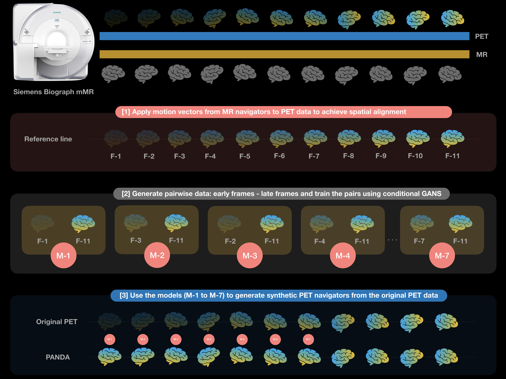
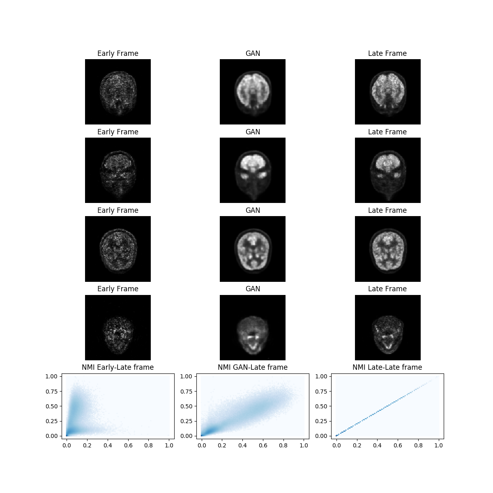
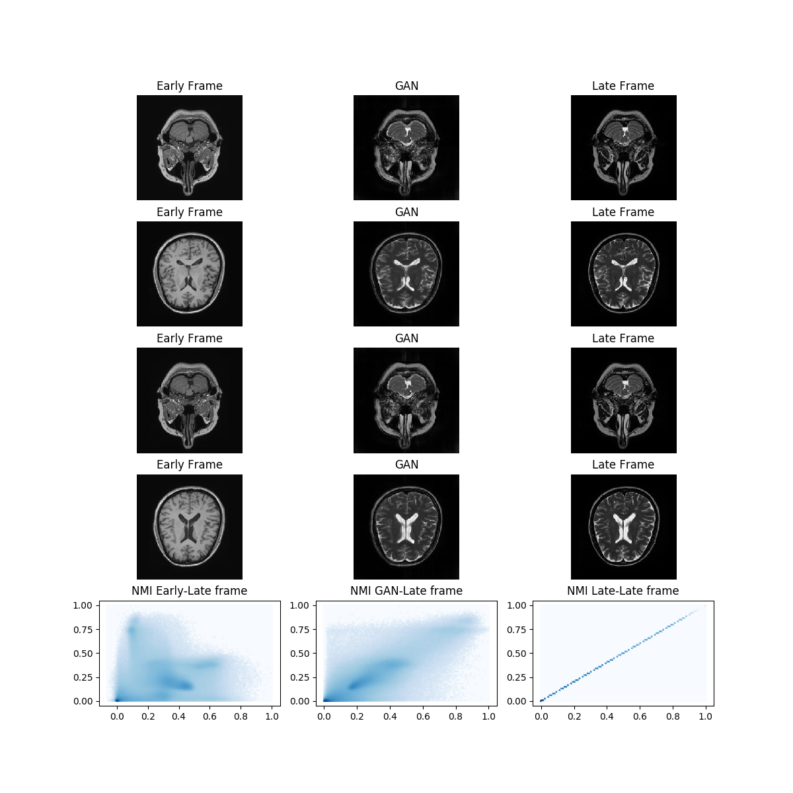

# PANDA: PET nAvigators usiNg Deep leArning

PANDA (Pytorch) pipeline, is a computational toolbox (MATLAB + pytorch) for generating PET navigators using Generative Adversarial networks. 
This is the Torch version of the first repository of PANDA (https://github.com/LalithShiyam/QIMP-tools/tree/master/PANDA/3D%20GAN) that was developed in Keras.

# Workflow



# Examples
Sample of the logger, which helps to monitor the training process to convert early frames into late frames:


# Requirements

- MATLAB R2016a or higher
- SPM 12
- Pytorch
- See requirements.txt list (execute "pip install -r requirements.txt" to install the python dependencies)

# MATLAB scripts and their function 

- checkFileFormat.m : Checks the format of the medical images in a given folder, the output is a string which says if the folder contains 'Dicom', 'Nifti' or 'Analyze'.

- convertDicomtoNii.m: Converts the Dicom series in a folder to nifti files, using SPM.

- cropNiftiForGan.m: Crop the image to remove the voxels of the background

# Python scripts and their function

- organize_folder_structure.py: Organize the data in the folder structure for the network

- init.py: List of options used to train the network. 

- NiftiDataset.py : They augment the data, extract the patches and feed them to the GAN (reads .nii files). NiftiDataset.py
  skeleton taken from https://github.com/jackyko1991/unet3d-pytorch

- check_loader_patches: Shows paired early and late frames patches fed to the 3DGANGan during the training  

- generators.py / discriminators.py : the architectures of the 3DGAN.

- train.py: Runs the training the training dataset.

- logger.py: Generates sample images to monitor the training.

- predict_single_image.py: It launches the inference on a single input image chosen by the user.

*******************************************************************************
### Pre-trained-model
The weights for generator and discriminator are available and you can download them from the following link:
- https://drive.google.com/drive/folders/11cNxT9rx6ztX8jA-dppeengsiW7DWzbY?usp=sharing
*******************************************************************************

# Tutorial for 3DGAN

## Training:

1) Launch the matlab file "convertDicomtoNii.m" to convert Dicom files in Nifti format.

2) (Optional) Launch cropNiftiForGan.m to crop the image and remove the noise of the background region around the skull. This script was tested for Siemens Biograph mMR,
cropping the 344x344x127 original frame into 128x128x128 frame. Please change the code depending of your needs.  

3) Launch organize_folder_structure.py to organize the data for the training. If early-frames  are in in "./volumes" folder and late-frames in "./labels" folder run: 

```console
python organize_folder_structure.py --images ./volumes --labels ./labels --split 2
```

Be sure that early and late frames were correctly paired in the two original "./volumes" and "./labels" folders. The value "split" is the number of samples saved as testing dataset

Resulting folder Structure:

	.
	├── Data_folder                   
	|   ├── train              
	|   |   ├── patient_1             # Training
	|   |   |   ├── image.nii              
	|   |   |   └── label.nii                     
	|   |   └── patient_2             
	|   |   |   ├── image.nii              
	|   |   |   └── label.nii              
	|   ├── test               
	|   |   ├── patient_3             # Testing
	|   |   |   ├── image.nii              
	|   |   |   └── label.nii              
	|   |   └── patient_4             
	|   |   |   ├── image.nii              
	|   |   |   └── label.nii            


4) Launch the pipeline for training: 
```console
python train.py 
```
There are several parameters you can set for the training; depending on your dataset characteristics you can modify the default ones by opening the init.py file. 
The description for each parameter included is in the init.py source file.

## Inference:

Launch the inference on only one image (example):

```console
python predict_single_image.py --image "path to early frame" --result "path where to save the late frame" --weights "path to the weights of the generator network to load"  --patch_size=(128,128,64)
```
### Sample script inference
```console
C:\Users\David\Desktop\3D GAN>python predict_single_image.py --image C:\Users\David\Desktop\test_image.nii --result C:\Users\David\Desktop\result.nii --weights C:\Users\David\Desktop\g_epoch_200.pth
```

## CGan Usage

The platform can be used for other image-translation tasks: here there is an example to convert T1 to T2 MR brain images.
The free dataset is available at https://brain-development.org/ixi-dataset/


## Citations

To implement PANDA Pytorch we were inspired by existing codes from other github contributors. Here is the list of github repositories:

- https://github.com/mrzhu-cool/pix2pix-pytorch

- https://github.com/junyanz/pytorch-CycleGAN-and-pix2pix


